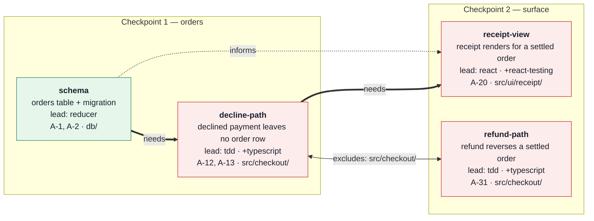

# Graph Engineering

A fan-out is not a graph. Launching N agents at one scope is scatter-gather; a graph exists only when some units depend on, inform, or exclude others, and then the ordering *is* the work. Build the graph: a verification contract fixed before any node runs, nodes cut at judging seams, edges that state why order matters, a schedule that defaults to serial and earns every concurrency, one independent verifier per node — and a rendering the user reads and approves before the first node is dispatched.

Three rules carry the rest.

- **The contract precedes the artifact.** Define correctness before implementation, or implementation defines correctness and every later check merely confirms it.
- **Whoever built it does not judge it.** Every node is judged by a fresh context that never saw the building.
- **Concurrency is an exception with evidence.** Serial is the default because conflicting edits, duplicated work, and divergent decisions cost more than the wall-clock they save.

Build a graph only when there are edges to schedule: one unit depends on or is informed by another's result, or two units share a write scope or a single-writer resource. When no unit writes and no unit depends on another, run the units as plain concurrent reads and return their results — no contract, no ledger, no verifier seat, no heartbeat. One unit of work in one context is not a graph, and no amount of structure rescues a goal that was never fixed.

## Roles

| Role | Owns | Never |
|---|---|---|
| Orchestrator | contract, cut, edges, schedule, integration, re-planning | implements a node's artifact, or judges one |
| Worker | one node's artifact and its raw evidence | judges its own work, or decides ordering |
| Verifier | one node's verdict against the contract | edits the artifact, or reads the worker's reasoning |
| Heartbeat | usage headroom, the pause trigger, the resume schedule | implements, judges, or re-plans a node |

Compose each agent from **skills, not one skill per agent**. A node's brief names one **lead skill** that governs its method, plus **supporting skills** that govern the other aspects it touches — language, domain, testing, delivery. Skills compose when they govern different aspects and conflict when they govern the same one; two skills that both claim the method are two nodes, or a choice between them. Name the composition explicitly in the brief and record it in the ledger, because the composition is part of what produced the artifact.

## 1. Fix the verification contract

Fetch the remote first. A local view that is hours old is not evidence of what the base branch contains or lacks, and a spec cut first on a stale view invalidates every node behind it. Then read the specs, stories, issues, and repository rules that govern the run, and record each source's locator and revision as fetched. When the run names several specs, confirm their full priority order with the user before cutting any node. Record a conflict between the user's latest message and an earlier ledger as an open question, and do not resolve it by choosing one.

Derive the contract **before cutting any node**: every in-scope normative statement becomes one independently decidable assertion, stated as an observable outcome rather than an implementation. Preserve each assertion's source identifier. Record conflicting or missing authority as an open question, never as a silent assumption.

Split the contract into two lanes, because they are verified differently:

| Lane | Assertion form | Verified by |
|---|---|---|
| Static | A property of the artifact: types, structure, checks, conventions | Running the checks and reading the artifact |
| Behavioral | An outcome a user or caller observes end to end | Exercising the running system |

Within the behavioral lane, mark each assertion as **gate-judged** or **reference-judged**. A gate holds or it does not. A reference-judged assertion is a matter of degree — fidelity to a supplied baseline such as a design export or reference screenshot — and the baseline is a governing source like any other: record its locator and revision. A reference-judged assertion is not decidable until the contract also fixes its **materiality threshold** (what counts as close enough — layout fidelity or pixel identity) and its **capture protocol** (viewport, theme, seed data, animation state — whatever makes the comparison reproducible). Fix both here; invented mid-verification they become the judge's opinion instead of the contract's.

An assertion that no lane can verify is a contract gap, and it stays visible until closed.

**Complete when:** every governing source is recorded with its revision, every in-scope statement maps to exactly one assertion in a named lane, every reference-judged assertion carries its baseline revision, threshold, and capture protocol, and every ambiguity is an open question rather than a guess.

## 2. Cut the nodes

A node exists where there is a **judging seam** — an artifact that can be verified against its own assertions without waiting for the rest of the graph — and a **bounded write scope**. Both, or it is not a node.

For each node record: identifier, the assertions it owns, its owned paths, its lead and supporting skills, its deliverable, and its non-goals. Keep tightly coupled work in one node; splitting work that cannot be judged apart buys nothing and costs a handoff.

For a change to existing code, render the shape with `pseudocode` before cutting. Owned paths and module boundaries read from the source hold up at dispatch; the ones inferred from a spec collide the first time two nodes touch the same file.

Check coverage in both directions. Every assertion is owned by at least one node, and every node owns at least one assertion. An unowned assertion is missing work. A node owning nothing is ceremony.

A node whose scope is itself a graph — a spec containing stories — **expands into a subgraph**. Its contract is the seam: the parent owns the edges between specs, the child owns the edges between its stories, and neither reaches across.

**Complete when:** every node has a judging seam, non-overlapping owned paths, a named skill composition, and at least one assertion; and every assertion has an owner.

## 3. Draw the edges

An edge is a claim about order, and it needs a reason recorded beside it.

| Edge | Meaning | Releases when |
|---|---|---|
| `needs` | B builds on A's result and cannot start without it | A's artifact is verified **and integrated** into B's base |
| `informs` | B is better for A's findings but can proceed with them as a brief | A's output is available as input |
| `excludes` | A and B carry no data dependency but cannot run together | The other has finished |

`excludes` is what most graphs get wrong. Two nodes exclude each other when they write the same paths, when they would each decide the same open architectural question, or when they share a resource that tolerates one writer. Absence of a data dependency is not independence.

Approval, a green check, or an open pull request does not satisfy `needs`. Only integration into the base the dependent node will build on does.

An edge without recorded evidence is an assumption; mark the dependent node blocked until the edge is confirmed or dropped.

**Complete when:** every edge names its kind, its reason, and its evidence; the graph is acyclic; and no cycle was broken by deleting an edge rather than by re-cutting the nodes.

## 4. Schedule the frontier

The frontier is every node whose `needs` are integrated and which excludes no running node.

**Schedule writes serially.** Run one artifact-producing node at a time and let the next inherit an integrated, verified base. This is slower on paper and more correct in practice: parallel writers conflict, duplicate work, and settle the same open question in different directions, and reconciling that costs more than the concurrency returned.

**Parallelise reads freely.** Search, code reading, research, static analysis, and independent review have no write scope and no ordering, so run them concurrently inside a node and inside verification.

Admit concurrent writers only when all four hold, and record which node pairs qualified:

1. Owned paths are disjoint, including generated files, lockfiles, and migrations.
2. No shared open decision — neither node will settle a question the other also settles.
3. Each is independently verifiable against its own assertions.
4. Each is isolated at the workspace level — its own worktree with dependencies installed — so an unverified artifact cannot leak into a sibling's base.

Otherwise the wall-clock gain is borrowed against the integration bill.

**Complete when:** the frontier is derived from integration state rather than intent, every concurrent pair satisfies all four conditions with the check recorded, and every blocked node names the exact gate holding it.

## 5. Render the graph and get approval

Nothing is dispatched until the user has seen the graph. Render it as Mermaid, one node per box, with the edge grammar carrying the schedule:

| Edge | Renders as | Reads as |
|---|---|---|
| `needs` | `A ==>\|needs\| B` | Thick — B cannot start until A is verified and integrated |
| `informs` | `A -.->\|informs\| B` | Dotted — B is better for A's output but is not gated on it |
| `excludes` | `A <-->\|"excludes: reason"\| B` | Double-headed — neither may run while the other runs |

Every box states the node's identifier, its deliverable in one line, its lead and supporting skills, the assertions it owns, and its owned paths — so the user can see what each sub-agent will be working on without reading a brief. A node carrying a reference-judged assertion also states its verifier mode — `verify: gauntlet · <threshold> · <budget>` — so the loop is approved as part of the graph, not discovered during it. Node classes show state: `ready` is on the frontier now, `blocked` is waiting on a gate, `done` is verified and integrated.

Publish the diagram with the run summary beside it: node count, how many run serially, which pairs run concurrently and which of step 4's four conditions justified each, the seat assigned to each role, and any assertion still unowned. Then **stop and get approval.** Present open questions and contract gaps here — this is the cheapest moment to re-cut the graph, and the last one before tokens are spent building the wrong shape.

For each node carrying a reference-judged assertion, the approval also confirms three parameters that are the user's to set, because they are a spend decision rather than a correctness one: **depth** — a single comparison, a budgeted gauntlet, or loop-until-win; the **materiality threshold** from the contract; and the **critic seat**. Record the answers in the node's brief and the ledger before dispatch — no runtime can pause mid-run to renegotiate a stop policy. A graph with no reference-judged node asks nothing extra.

When the graph is too large to read at once, render one diagram per checkpoint plus a checkpoint-level overview. Never drop a node to make the picture fit; a diagram that omits work reads as work that does not exist.

**Complete when:**

- the render preserves the governing sources and their open contract gaps;
- every node and edge in the ledger appears with its kind;
- every box names its deliverable, lead and supporting skills, assertions, and paths;
- each concurrency claim records all four qualifying conditions;
- every reference-judged node's depth, threshold, and critic seat are confirmed; and
- the user has approved the graph or asked for it to be re-cut.

## 6. Dispatch with isolation

Give each worker a brief and nothing else. Session history carries the orchestrator's assumptions into the node, and every node then inherits the same blind spot. Brief contents and templates are in [`references/briefs.md`](references/briefs.md).

Bootstrap every isolated workspace before its first commit: a fresh worktree has no installed dependencies, so hooks and checks that run through them fail until the install has run. Merge an updated base only onto committed work, so the merge cannot mix with unrecorded edits. Re-install after every base merge that changes a lockfile or manifest, before any long check runs on the merged base. A hook rejection caused by missing dependencies is a workspace failure: repair it by installing and retrying the commit, not by editing the artifact and not by bypassing the hook.

Pick the runtime, then read how this graph maps onto it — each reference names the parts of this skill the runtime does **not** enforce for you:

| Host | Reference | Nodes run as |
|---|---|---|
| Claude Code | [`references/dynamic-workflows.md`](references/dynamic-workflows.md) | `agent()` calls in a workflow script — deterministic ordering, enforced contracts, ephemeral contexts |
| Codex | [`references/codex-threads.md`](references/codex-threads.md) | Managed threads — durable contexts, a worktree per node where the runtime provides one, ordering held by the coordinator against a written ledger |

Step 5's approval gate runs inline before either is launched, because neither a background script nor a spawned thread can pause to be approved.

Maintain one **shared state artifact** every agent reads: the contract, the ledger, the decisions already settled, and the constraints that apply to everyone. Broadcast changes there rather than re-briefing each node, so late nodes and early nodes work from the same facts.

Assign the seat to the model, not the model to the run. Planning rewards careful reasoning; implementation rewards fluency and speed; verification rewards precise instruction-following, and gains independence when it does not share a provider — and therefore a bias — with the worker it judges. Record each seat assignment; it is a variable in the result.

**Spawn the heartbeat with the first node.** A graph long enough to need scheduling is long enough to hit a provider usage limit mid-run, and a hard limit strikes at the worst moment: mid-node, with unverified work in flight and no context left to park it. Run one heartbeat monitor alongside the workers — it polls whatever usage signal the host exposes (rate-limit headers, session budget, quota windows), logs headroom to the shared state, and owns nothing else. Its brief is in [`references/briefs.md`](references/briefs.md).

At the headroom threshold — **90% of any limit** unless the user set another — the heartbeat triggers the pause protocol rather than letting the run hit the wall:

1. Freeze the frontier — no new node is dispatched.
2. Drain, don't kill. A node close to its handoff finishes; any other parks by writing a partial handoff: what is done, what is not, and its exact resume point.
3. Write the ledger and shared state as the resume brief — the run's entire memory must survive the pause.
4. Schedule the resume with the host's scheduler — a cron job, scheduled task, or wakeup — for when the limit window resets.
5. Stop cleanly and report the pause to the user: headroom consumed, nodes parked, resume time.

On resume, trust the repository over memory: re-read the ledger, recompute the frontier from observed integration state, resume durable agents where the runtime keeps them alive, and re-dispatch parked nodes from their partial handoffs where it does not. A resumed graph that skips this re-derivation continues the run the orchestrator remembers, not the one that exists.

When the nodes are stories delivered as pull requests, hand the delivery mechanics to `product-management:story-pr-orchestrator` — it owns the task, worktree, branch, PR, and merge gating. This skill keeps the contract, the edges, and verification, and treats a merge as what releases a `needs` edge.

**Complete when:** every dispatched node has an acknowledged brief, owned paths, and an isolated workspace; the shared state is current; every seat assignment is recorded; and the heartbeat is running with a named threshold and a working resume mechanism.

## 7. Verify each node independently

Every node gets its own verifier in a **fresh context**, given only the assertions it owns and the real artifact; that verifier gathers its own raw evidence. Withhold the worker's narration, rationale, summaries, and any claim of quality — a verifier that reads the argument for the work inherits it.

The fresh verifier checks both lanes itself. For static assertions, it runs the checks and reads the artifact; parallel reviewers inside this lane are cheap and independent. For behavioral assertions, it **exercises the running system** — starts it, drives it, and observes the outcome. Passing tests written alongside the implementation are the weakest evidence in the graph, because they were shaped by the code rather than by the contract.

For every assertion verified by running a command, record the exact command, its exit code, and the resulting verdict.

Each verifier returns one verdict per assertion:

| Verdict | Meaning | Next |
|---|---|---|
| `pass` | Evidence shows the assertion holds | Eligible for integration |
| `fail` | The evidence path was exercised and the evidence does not establish that it holds | Return the single largest gap to the worker |
| `unjudgeable` | The evidence path did not permit a decision | Repair the evidence path, not the artifact |

On `fail`, hand the gap back to the worker that holds the context, then judge the repair with a **new** verifier. Re-judging with the previous one re-runs a context that has already committed to a conclusion. Never integrate on `unjudgeable`; a claim that could not be checked is not a claim that held.

A **reference-judged** assertion needs repeated build-and-judge rounds instead of one verdict. Run `gauntlet-loop` inside that node — the loop is orchestration, not a seat. Its builder is the node's worker and persists across rounds, because it holds the accumulated context of the artifact; its critic is a fresh verifier every round, given only the baseline, the artifact captured per the contract's protocol, and the threshold — never the round history or the builder's narration. Neither knows it is inside a loop: a builder that knows the stop policy argues for stopping, and a critic that sees round history inherits the previous critic's conclusions.

Verify the node's gate-judged assertions first with ordinary single-pass verifiers; only the degree assertions loop. There is no point paying critics to judge fidelity on an artifact whose gates fail. The loop's terminal verdict maps directly into the ledger — `WIN` is `pass`, `LOSE` is `fail`, `UNJUDGEABLE` is `unjudgeable` — and a loop stopped by budget exhaustion enters as `fail` with its unmet gaps recorded, never as a pass. The loop executes the depth, threshold, and seat fixed at step 5's approval; it does not renegotiate them.

**Complete when:** every assertion the node owns has a verdict backed by evidence in its lane, no verdict came from the context that produced the artifact, and no `fail` or `unjudgeable` was resolved by narrowing the assertion.

## 8. Integrate at checkpoints

A node closes by writing a **structured handoff**, not by reporting completion: what it delivered, what it left undone, every command run with its exit code, issues discovered, decisions it settled that the graph must adopt, and where it departed from its brief. The handoff schema is in [`references/briefs.md`](references/briefs.md).

Treat an unaddressed handoff issue as a blocking gate. Progress past an unread handoff is how a graph drifts while every node reports success.

Group nodes into checkpoints and re-plan at each boundary rather than continuously. At a checkpoint: integrate what passed, fold settled decisions into the shared state, scope follow-up nodes for what failed or was discovered, and recompute the frontier from the new integration state. Expect the first pass at a checkpoint to fail; follow-up work is the normal output of verification, not an exception to it.

Re-render the graph at every checkpoint with node classes updated — `done` for integrated, `ready` for the new frontier, `blocked` for the rest — and follow-up nodes drawn in with the edges that created them. The diagram is how the user tracks a run they are not watching; a graph that only gets drawn once stops describing the run the moment the first node lands.

Perform integration and any outward-facing action only within the authority already granted, and re-derive the frontier after each one.

**Complete when:** every integrated node passed its verifier and its handoff was read and cleared, every discovered issue became a scoped node or a recorded acceptance, and the frontier was recomputed from observed state.

## 9. Report the ledger

Lead with the contract's coverage — assertions passed, failed, unjudgeable, and unowned — then the final render of the graph in its terminal state, then the ledger behind it:

| Node | Assertions | Skills | Edges | Schedule | Verdict | Evidence | Handoff |
|---|---|---|---|---|---|---|---|

Follow with: nodes run concurrently and which of the four conditions justified each, seat assignments, follow-up nodes created at each checkpoint, any pause the heartbeat triggered with its resume and what was parked, contract gaps still open, and the smallest next action for every blocker.

Report failures, skipped nodes, and dropped scope explicitly. A graph that quietly shed a node reads as coverage it never delivered.

**Complete when:** every assertion appears exactly once with a verdict or a named gap, every citation resolves, the ledger matches observed state rather than intent, and no action exceeded the granted authority.
