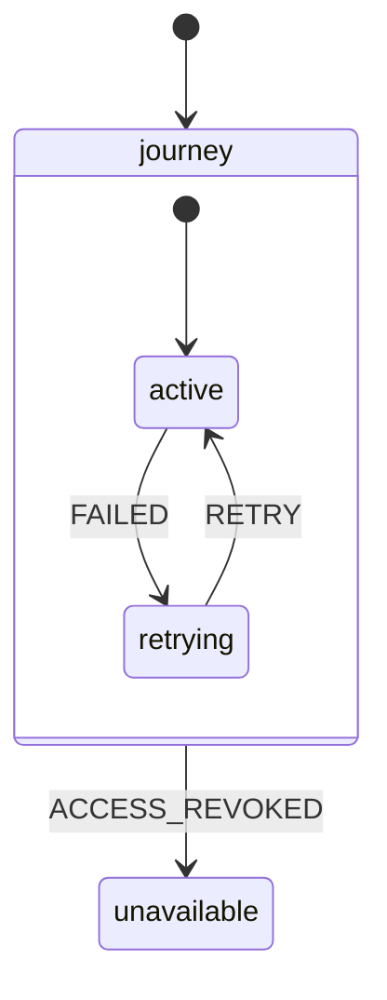
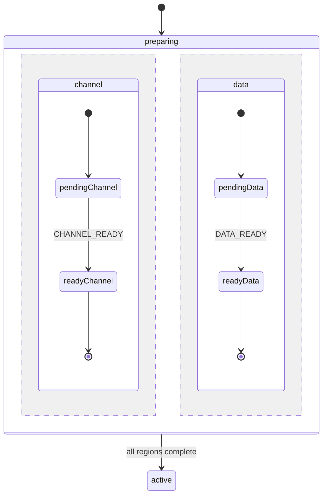
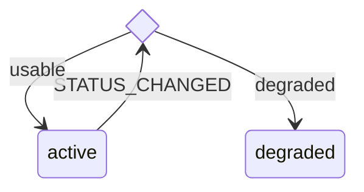

# Render XState with Mermaid

## Render from the final machine

Render `stateDiagram-v2` when the user asks for a diagram and after designing or changing a machine. For a visualisation-only request, preserve the implementation.

Trace each `createMachine` definition. Include initial, final, compound, and parallel states; targeted `on`, `always`, `after`, and completion transitions; guards; invokes; and intentionally global root transitions. Mark proposed machines as proposed. Cite the source for existing machines.

Show state-changing transitions. Omit targetless actions and context-only events. Show a self-transition only when re-entry matters. State material omissions below the diagram.

## Keep machine boundaries visible

Render one diagram for each independent `createMachine`. Render an invoked state machine separately when its lifecycle matters. Describe callback, promise, observable, transition, and other non-statechart actors as resources or attempts. Do not invent internal states for them.

Use a flowchart only when the user also asks for actor-system composition.

## Map XState semantics

| XState                        | Mermaid                                                   |
| ----------------------------- | --------------------------------------------------------- |
| Machine or compound `initial` | `[*] --> stateId` in that scope                           |
| `type: "final"`               | `finalId --> [*]` in the owning scope                     |
| Targeted `on`                 | `source --> target: EVENT`                                |
| Guard                         | Add its short meaning after the event                     |
| `always`                      | Label `always - condition`                                |
| `after`                       | Label the delay meaning                                   |
| `onDone`                      | Label `complete` or `all regions complete`                |
| Parallel state                | Composite regions separated by `--`                       |
| Guarded destinations          | `state choiceId <<choice>>`                               |
| State invoke                  | State description such as `Active - invokes liveResource` |

Use public event names when readable. Describe guard meaning in plain language instead of copying code.

## Keep composite transitions legal

Mermaid rejects transitions between internal states of different composites. Keep both endpoints in one lexical composite. For an exit from a nested state, draw the transition from the nearest owning composite and explain the internal source when it matters.

The root arrow leaves `journey`; it does not connect an internal state directly to `unavailable`.

Describe a multi-target transition across parallel regions in prose. Cross-region arrows are illegal and can imply false ordering.

## Render parallel states and choices

Represent a parallel state as one composite with `--` between regions. Give each region an initial state. When the parent waits for every region, end each region at `[*]` and label the parent transition `all regions complete`.

Wrap a root parallel machine in a named outer composite and connect `[*]` to it. Use Mermaid concurrency for persistent parallel regions. Reserve `<<fork>>` and `<<join>>` for actual fork or join semantics.

Use `<<choice>>` when guards route one event to several states. Keep the choice and its destinations in one composite scope.

## Use safe syntax

Start with exactly `stateDiagram-v2`. Use `direction TB` for hierarchy or concurrency and `direction LR` for a small flat lifecycle.

Use stable identifiers without spaces or punctuation. Add readable labels separately with `stateId: Readable label`. Keep labels on one plain-text line. Replace semicolons with commas or hyphens because Mermaid treats semicolons as statement separators. Prefer prose below the diagram to crowded notes. Avoid `classDef` styling inside composite states.

## Validate and deliver

Use the repository renderer or Mermaid CLI when available. Otherwise preview the diagram when practical and inspect it against the [official state-diagram grammar](https://mermaid.js.org/syntax/stateDiagram.html).

Say `rendered` only after a renderer accepts the diagram. Otherwise report that syntax was inspected and mechanical rendering was unavailable.

For each machine, return:

1. its name and source path, or a proposed-artifact label;
2. one fenced `mermaid` block;
3. material invokes, abstractions, and omitted non-state-changing events;
4. the validation method and result.

Complete only when every changed machine has one source-grounded, scope-legal diagram.
